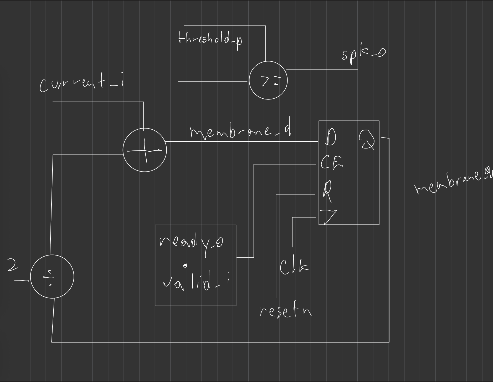
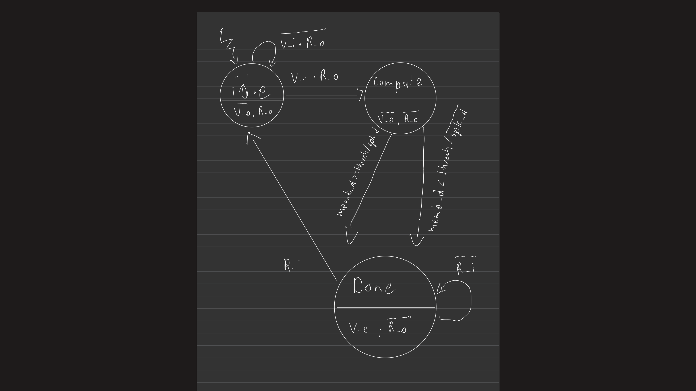
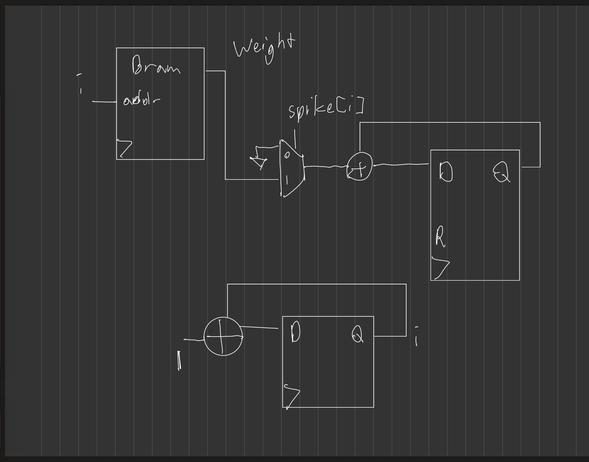
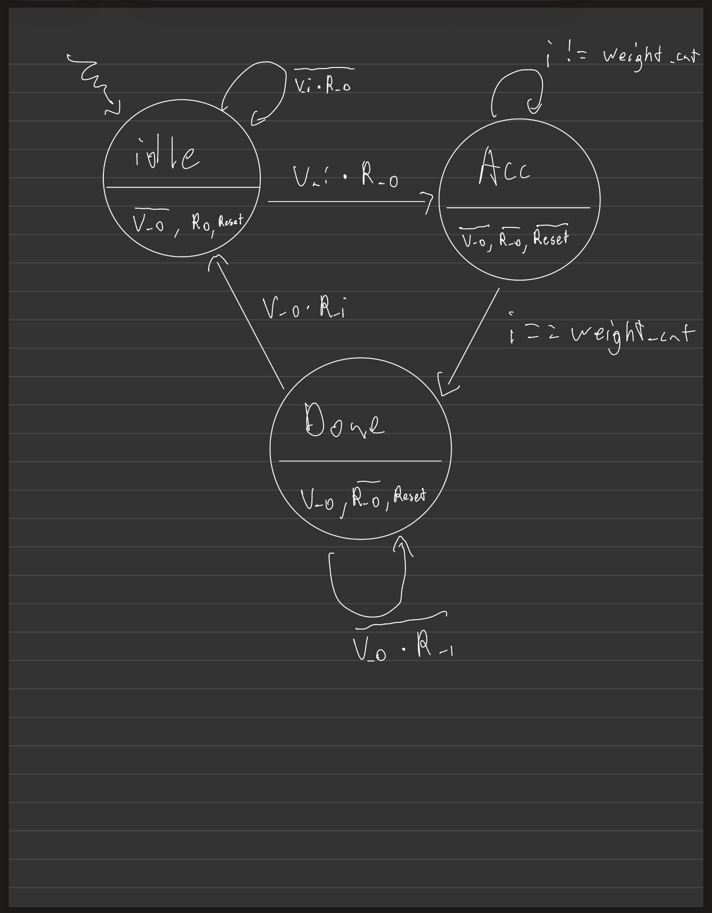
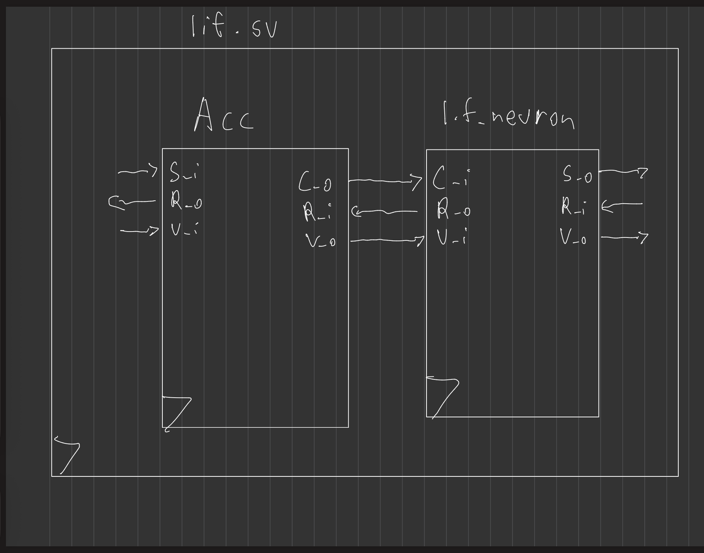
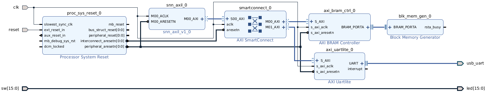
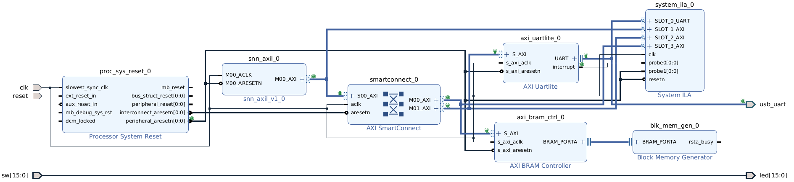

## Structure of Presentation

1. Prequisites of Project
2. FPGA Design
3. Data Processing
4. Future Work
5. Conclusion

## Prequisites

---

### Software

This project involves several software stacks to run. Software is classified
by what it is targetting: data processing, FPGA flow, website/documentation

---

### Data processing

The dataset is stored in `hdf5` files or `.h5` files. An hdf5 reader or
library is required extract data from these files. This project uses
the Python `h5py` and `hdf5plugin` modules. To install them use the
following:

```
conda install h5py
pip install hdf5plugin matlibplot
```

---

### How to process data

Data processing is done through the central makefile commands:

```
#To download the dataset
make download-dataset

#To process dataset and make packets
make process-dataset

#To send packets to FPGA
make send-to-fpga
```

---

### FPGA Flow

This SNN is deployed on a Xilinx `Basys3` board with an Artix7 FPGA. The
Xlinix Vivado version used for this project is `2025.2`.


---

### To run the FPGA Flow

The FPGA flow is ran through the central makefile commands:

```
#To create the Vivado project
make project

#To run simulations
make run-sim

#To run the FPGA flow and generate a bitstream
make run-pnr

#To flash the bitstream onto the FPGA
make board-flash
```

---

### Documentation Flow

To create this website, this repo uses `pandoc` along with `reveal.js` to
generate the HTML slide show. This project specifically uses `pandoc 3.8.2.1`
and thus is installed manually by doing the following:

```
wget https://github.com/jgm/pandoc/releases/download/3.8.2.1/pandoc-3.8.2.1-1-amd64.deb
sudo apt install ./pandoc-3.8.2.1-1-amd64.deb
```

---

### To create the website

To create this website, use the central makefile command:

```
make page
```

Deployment is handled via `Github Actions` and the `deploy.yml` workflow file.

## FPGA Design

---

### Leaky Integrate Fire Neuron



---

### LIF Neuron FSM for Data Transfer



### Accumulator Design



---

### Accumulator FSM for Data Transfer



### LIF + Accumulator



### Spiking Neural Network Architecture

Input layer - 6 Neurons
Hidden layer - 32 Neurons
Output layer - 3 Neurons

Note: Input layer neurons take in current while hidden and output layer neurons take in spikes

---

### SNN with AXI Lite

AXI Lite is a communication protocal for FPGA systems. Useful for memory mapped IO on the system. SNN uses it to
communicate to the UART module for data transmission and external BRAM to store incoming data for processing. UART
address is `0x0-0x80` and the external BRAM is `0x80-0xFF`.

---

### Top Level Design



---

### Top Level Utilization and Timing Report

- Timing Report

  - WNS - 1.746ns
  - WHS - 0.026ns

- Utilization
  - LUT - 4873/20800 (23.43%)
  - LUTRAM - 13/9600 (0.14%)
  - FF - 5271/41600 (12.67%)
  - BRAM - 0.50/50 (1.00%)
  - IO - 36/106 (33.96%)

---

### Top Level Design with ILA



---

### Top Level (ILA) Utilization and Timing Report

- Timing Report

  - WNS - 2.176ns
  - WHS - 0.026ns

- Utilization
  - LUT - 8633/20800 (41.50%)
  - LUTRAM - 708/9600 (7.73%)
  - FF - 11266/41600 (27.08%)
  - BRAM - 11.50/50 (23.00%)
  - IO - 36/106 (33.96%)

## Data Processing

---

###

## Future Work

---

### TBD

## Thanks for watching

Contributions are welcome at [https://github.com/gmejiamtz/snn-practice](https://github.com/gmejiamtz/snn-practice)
